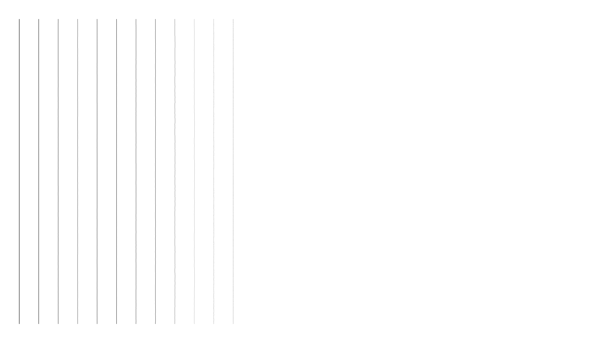

# Setup
```
virtualenv -p python3 venv
. venv/bin/activate
pip install -r requirements.txt
python3 test_sl.py
python3 sl.py
```


# Most recent output




# Ideas/Tasks
- [x] vertical line, N pixels wide
- [ ] various constant roll off functions
- [ ] random parameters in roll off functions
- [ ] horizontal variation with hard corners
- [ ] horizontal variation with soft corners
- [ ] horizontal line
- [ ] diagonal line
- [ ] curves/circles
- [ ] SVG rendering with above
